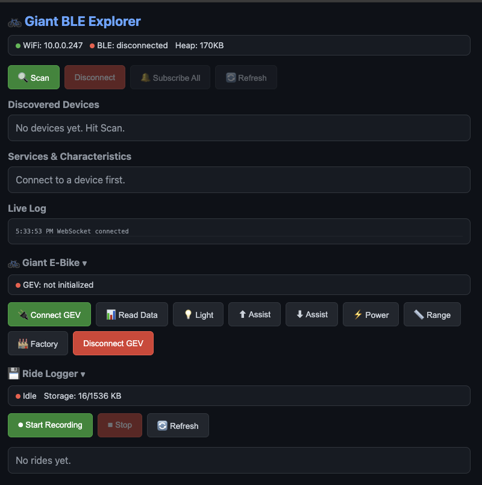

# Giant E-Bike BLE Explorer

ESP32-S3 firmware to communicate with Giant e-bikes (Stormguard E+ 2 and similar models) over Bluetooth Low Energy. Includes a browser-based dashboard for live ride monitoring, bike control, and ride logging.

Inspired by [JamieMagee/specialized-turbo](https://github.com/JamieMagee/specialized-turbo) and [Sepp62/LevoEsp32Ble](https://github.com/Sepp62/LevoEsp32Ble).

## Features

- **BLE Scanner & Explorer** — Scan, connect, and browse GATT services/characteristics of any BLE device
- **Giant RideControl+ Protocol** — Full implementation of the GEV BLE protocol (AES-128-ECB encrypted commands), reverse-engineered from the official Android app
- **WiFi Web Server** — Browser-based SPA dashboard accessible over your local network
- **mDNS Discovery** — Access at `http://giant-esp32.local`, no need to find the IP
- **OTA Updates** — Flash firmware over WiFi after initial USB setup
- **WiFi Manager** — Captive portal for WiFi setup, credentials stored in NVS, BOOT button to force AP mode
- **Live Ride Dashboard** — Real-time speed, power, cadence, torque, battery, distance, and ride time
- **Bike Controls** — Toggle light, adjust assist level, read factory/diagnostic info
- **Ride Logger** — Record ride data to flash storage (LittleFS) as CSV, download when home via WiFi



## Hardware

- **Board**: ESP32-S3-WROOM-1 (any ESP32-S3 dev board)
- **Target bike**: Giant Stormguard E+ 2 (2023) or similar Giant e-bikes with RideControl+

## Quick Start

### Prerequisites

```bash
pip install platformio
```

### Build & Flash

```bash
pio run -e esp32s3 -t upload
```

If the port isn't auto-detected:

```bash
pio run -e esp32s3 -t upload --upload-port /dev/cu.usbserial-*
```

> **Tip**: If upload fails, hold **BOOT**, press **RESET**, release **BOOT**, then retry.

### WiFi Setup

**Option A: Captive Portal (recommended)**

On first boot with no saved credentials, the ESP32 starts an AP called `Giant-ESP32-Setup`. Connect to it and a config portal opens automatically where you can select your WiFi network and enter the password.

**Option B: credentials.h**

Create `src/credentials.h` (gitignored):

```cpp
#pragma once
#define WIFI_SSID "YourSSID"
#define WIFI_PASSWORD "YourPassword"
```

> To force AP mode at any time, hold the **BOOT** button while pressing **RESET**.

### OTA Updates

After the initial USB flash, you can update over WiFi:

```bash
pio run -e esp32s3 -t upload --upload-port giant-esp32.local
```

### Monitor Serial Output

```bash
pio device monitor
```

## Usage

### Web Interface

After flashing, the ESP32 connects to WiFi and is accessible at `http://giant-esp32.local` (via mDNS) or by IP address (shown on serial). Open it in a browser to access the dashboard.

**BLE Explorer tab:**
- Scan for nearby BLE devices
- Connect to any device and browse its GATT services
- Subscribe to notifications

**Giant E-Bike tab:**
- Auto-detects Giant GEV service on connect
- Live dashboard: speed, battery, watts, cadence, torque, distance, ride time, range
- Controls: light toggle, assist up/down, power, read factory data

**Ride Logger tab:**
- Start/stop recording ride data
- Samples every 2 seconds: speed, cadence, torque, watts, battery%, distance, time, range
- Data stored as CSV on flash (1.5 MB available, persists across reboots)
- Download ride files via browser when back on WiFi
- NTP-synced timestamps

### Serial Commands

| Command | Description |
|---------|-------------|
| `s` | Start BLE scan |
| `c AA:BB:CC:DD:EE:FF` | Connect to a device |
| `d` | Disconnect |
| `r` | Re-discover services |
| `n` | Subscribe to all notifications |
| `h` | Show help |

### Filtering

Edit `src/config.h` to auto-connect to a specific device by name or MAC address.

## Giant GEV Protocol

The Giant protocol uses a custom GATT service with AES-128-ECB encrypted commands:

| UUID | Role |
|------|------|
| `4D500001-...` | Service |
| `4D500002-...` | Write (commands) |
| `4D500003-...` | Notify (responses) |

Each packet is 18 bytes: `[0x21 header][16 AES-encrypted bytes][CRC]`. The protocol supports reading ride telemetry, factory data, diagnostics, and triggering bike controls (light, assist, power).

Protocol details were reverse-engineered from the [RideControl+ Android app](https://play.google.com/store/apps/details?id=com.giant.ridecontrolapp).

## REST API

| Endpoint | Method | Description |
|----------|--------|-------------|
| `/api/status` | GET | WiFi/BLE status, heap |
| `/api/scan` | GET | Start BLE scan |
| `/api/devices` | GET | List discovered devices |
| `/api/connect` | POST | Connect to device `{"address":"..."}` |
| `/api/disconnect` | POST | Disconnect |
| `/api/services` | GET | List GATT services |
| `/api/giant/status` | GET | Ride/bike/factory data |
| `/api/giant/command` | POST | Send command `{"cmd":"riding"}` |
| `/api/rides` | GET | List recorded rides |
| `/api/rides/start` | POST | Start recording |
| `/api/rides/stop` | POST | Stop recording |
| `/api/rides/download?file=X` | GET | Download ride CSV |
| `/api/rides/delete?file=X` | DELETE | Delete a ride |
| `/api/wifi/status` | GET | WiFi mode, IP, credentials status |
| `/api/wifi/config` | POST | Save WiFi credentials `{"ssid":"...","password":"..."}` |
| `/api/wifi/forget` | POST | Clear saved WiFi credentials |
| `/api/wifi/scan` | GET | Scan for WiFi networks (AP mode) |

## References

- [Giant CAN bus RE](https://github.com/bobmorane83/Giant-CanBus)
- [Specialized Turbo BLE protocol](https://github.com/JamieMagee/specialized-turbo/blob/main/docs/protocol.md)
- [NimBLE-Arduino](https://github.com/h2zero/NimBLE-Arduino)
- [BLE Reverse Engineering guide](https://reverse-engineering-ble-devices.readthedocs.io/)

## License

MIT
